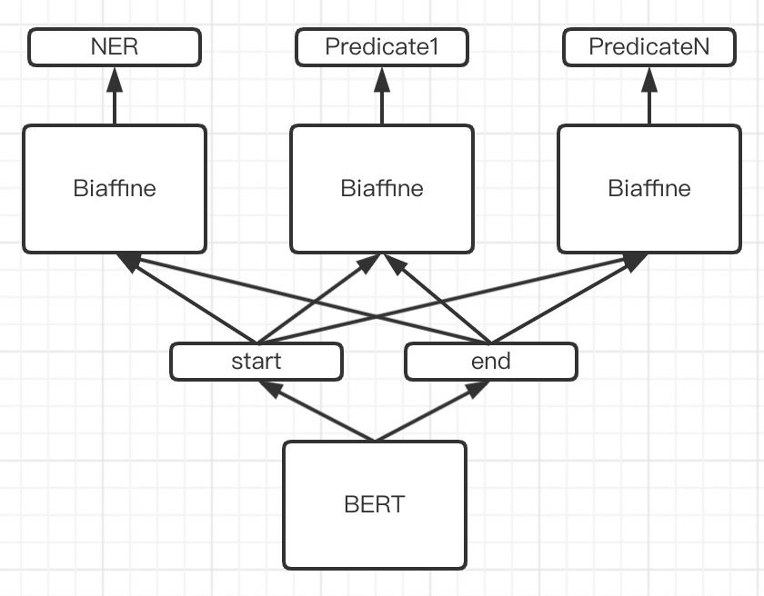
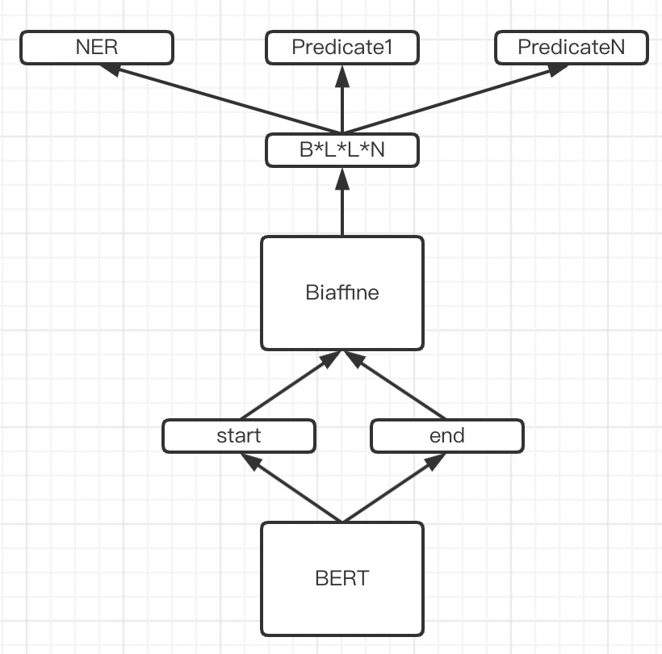

# 基于Biaffine结构的关系抽取模型

这一两个星期在研究关系抽取相关的内容，这里做一个小结。

主要的方法有pipeline形式和joint形式的，其中：

- pipeline的先抽取实体，再对实体之间进行关系判断
- joint则是直接将二者同时抽取出来，避免pipeline形式的误差累积以及更充分利用实体和关系之间的信息

个人原来做过pipeline形式的抽取，因此这里主要研究一下joint形式的抽取方法。

## 效果

对比了苏神的GPLinker，在LIC2019任务上验证集结果如下：

| 模型               | F1     |
| ------------------ | ------ |
| CasRel             | 0.8220 |
| GPLinker(Standard) | 0.8272 |
| Biaffine           | 0.8297 |

具体指标：

- precision 0.8124273240449063
- recall 0.8477354452999187
- f1 0.829705920456018

## 方法介绍

### 建模

如果了解过biaffine做NER抽取的应该知道，biaffine也是对token-pair进行建模，得到token-pair的信息。在NER中，我们最终得到的是[B,L,L,N]的tensor，代表了Batch中每个文本L*L个entity head(EH)-entity tail(ET)的标签信息。

为了获得关系信息，我们还需要得到SPO中subject head(SH)-object head(OH)和subject tail(ST)-object tail(OT)之间的联系。还有因为SPO中O可能出现在S的前面，因此还需要考虑OH-SH和OT-ST这类关系。这样根据SH-OH、OH-SH、ST-OT、OT-ST以及EH-ET的信息，我们可以判断句子中存在哪些关系。具体的话可以参考[TPLinker](https://github.com/131250208/TPlinker-joint-extraction)的建模方法。

一开始尝试的是TPLinker最开始的方法，分别对entity，spo的head、tail建模。设计了两种方案：

1. 第一种与做NER类似，只不过多加了predicate的biaffine识别

2. 第二种改了一下，biaffine出来的结果是[B,L,L,N]，其中N为hidden size，然后再分别过线性层转换为NER和predicate的标签预测

这两种建模方案试下来，在NER识别上效果还可以，但是在predicate识别上效果非常差，基本没学到信息。通过对数据进行分析发现，predicate的标签非常稀疏，在大部分数据上部分标签基本没有，这也导致部分predicate的参数较难学到有用的信息。

在这条路上做了一些尝试效果不佳后，开始尝试tplinker_plus的思路。

这个思路挺有意思的，将多分类问题转换为多标签分类问题，具体来说就是对每个token-pair，判断它是否是：

- 某类实体的EH-ET
- 某类P的SH-OH/OH-SH
- 某类P的ST-OT/OT-ST

转换为实体类别数量N + P类别数量M\*4个类别的多标签分类。在关系抽取里面可以不关心实体的具体类别，只要判断它是不是实体就好，这样就是1+M\*4个类别。

### 损失函数

对于多标签分类常见的是用binary-cross-entropy作为损失函数，这里用了苏神的[《将“softmax+交叉熵”推广到多标签分类问题》](https://kexue.fm/archives/7359)中提到的loss，可以解决类别不平衡的问题。具体来说就是下面这个形式。关于它的推导就请移步苏神的论文了。

### 解码

改成上面这种建模形式后，其实在原来的NER-biaffine基础上要做的改动就很小了，只需要将label改改，再加loss地方改改就OK了。

解码方面的流程与tplinker类似：

- 收集所有的实体位置信息entities = set((s,e))
- 对每类P，我们先根据SH2OH或OH2SH，以及entities的信息，找到满足subject和object的起始位置的entity，再判断subject和object实体的结束位置是否满足ST2OT或OT2ST。
- 只保留满足前面筛选条件的SPO对。

## 实验

使用哈工大开源的中文[electra-base](https://github.com/ymcui/Chinese-ELECTRA)模型作为预训练参数，设置head learning rate为20倍（即非BERT参数的学习率要乘以这个倍速），同时biaffine size从150调大到768（因为要包含的信息更多了），然后finetune了5个epoch。

没调参跑下来就得到上面的结果了。

## 总结

个人觉得biaffine结构还是比较简单的，只是加了两个dense层和一个W参数矩阵，没有在bert上面加复杂的骚操作，其实这个跟bert论文中的思路差不多，下游任务的时候尽可能都是加个简单的线性变换就好了。侧面说明BERT这种强大的预训练模型还是厉害，还有很多潜力可以去挖掘。

缺点就是基于token-pair形式的模型，它的输入数据空间复杂度还是比较高的$O(BL^2N)$ ，因此不适合用来抽取非常长的问题，尤其是抽取的关系是跨篇章结构的话，那就更难了。其次就是标签数据非常稀疏，即使我们只采用了上三角的数据，仍然有大量的0标签，如何解决这类稀疏标签的问题也值得研究。

